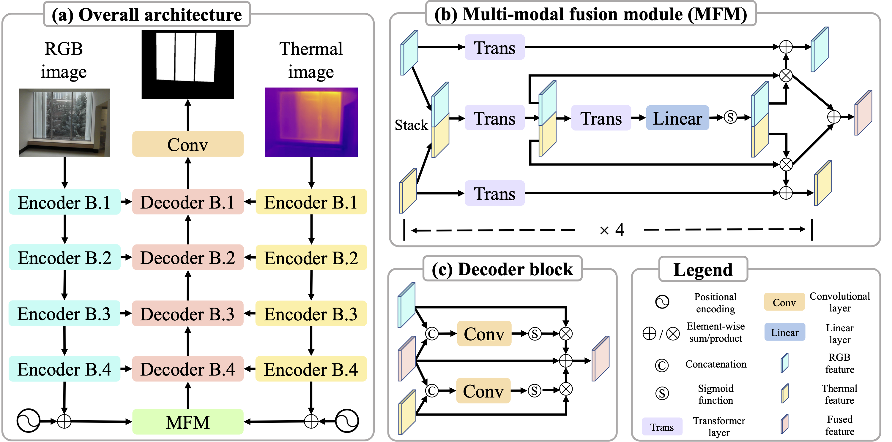

# RGB-T-Glass-Segmentation

Code for this paper [Glass Segmentation with RGB-Thermal Image Pairs](https://arxiv.org/abs/2204.05453)

Dong Huo, Jian Wang, Yiming Qian, Yee-Hong Yang

## Overview

This paper proposes a new glass segmentation method utilizing paired RGB and thermal images. Due to the large difference between the transmission property of visible light and that of the thermal energy through the glass where most glass is transparent to the visible light but opaque to thermal energy, glass regions of a scene are made more distinguishable with a pair of RGB and thermal images than solely with an RGB image. To exploit such a unique property, we propose a neural network architecture that effectively combines an RGB-thermal image pair with a new multi-modal fusion module based on attention. As well, we have collected a new dataset containing 5551 RGB-thermal image pairs with ground-truth segmentation annotations. The qualitative and quantitative evaluations demonstrate the effectiveness of the proposed approach on fusing RGB and thermal data for glass segmentation.

## Architecture

<p align="center">
  
</p>


## Datasets

The datasets utilized in our paper can be downloaded via the links below:
- [Our RGB-T dataset](https://drive.google.com/file/d/1ysG04qGmnZv7UaybZUuyybaJYJLUkNHX/view?usp=sharing)
- [GDD](https://mhaiyang.github.io/CVPR2020_GDNet/index)

## Prerequisites
- Python 3.8 
- PyTorch 1.9.0
- Requirements: opencv-python
- Platforms: Ubuntu 20.04, RTX A6000, cuda-11.1

## Training

RGB-T: ```python main.py```

RGB-only: ```python main.py --is_rgbt False```

Modify the arguments in parse_args()


## Testing

RGB-T: ``` python main.py --resume checkpoints_path --eval```

RGB-only: ```python main.py --is_rgbt False --resume checkpoints_path --eval```

Download the well-trained models ([RGB-T](https://drive.google.com/file/d/1ftTfKT_zDgTAuMurvgbnpuO2-uzkbgin/view?usp=sharing), [RGB-only](https://drive.google.com/file/d/1iN2JnHB7EW1nlgKeLkmUHA02Pc1P3Uae/view?usp=sharing))


## Citation

If you use this code and data for your research, please cite our paper.

```
@misc{huo2022glass,
      title={Glass Segmentation with RGB-Thermal Image Pairs}, 
      author={Dong Huo and Jian Wang and Yiming Qian and Yee-Hong Yang},
      year={2022},
      eprint={2204.05453},
      archivePrefix={arXiv},
      primaryClass={cs.CV}
}
```


